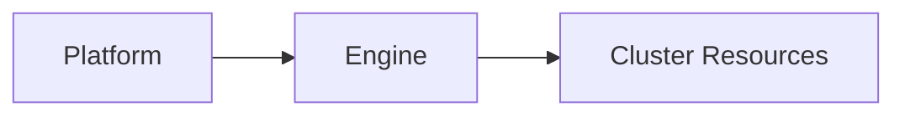

# Agnost Architecture Overview

Agnost is an open-source backend application development platform that operates
on Kubernetes clusters, designed to be cloud provider agnostic, simplifying the
switching process between cloud providers. The architecture of Agnost is
composed of various technologies and components grouped into three logical
clusters: Platform, Engine, and Cluster Resources.

### High Level Architecture

#### Platform

The platform modules handle backend application design and development. This
involves managing application data and enabling developers to create apps
through Agnost Studio, the platform's front end. The key components are:

- **Platform-Core:** The API server of the Agnost cluster. It handles user
  registration, organization, app and version creation, and manages data models,
  endpoints, cron jobs, message queues, and storage for each version.

- **Platform-Worker:** Performs asynchronous tasks on behalf of the
  Platform-Core, such as sending emails.

- **Platform-Sync:** A Socket.io real-time server used to send real-time
  messages about design and code changes of developed applications.

- **Platform-Studio:** A React-based front-end application for managing
  settings, resources, and users of your Agnost cluster, and creating and
  deploying new applications.

#### Engine

The Engine modules manage application deployment and execution. Developed
applications are deployed through the Agnost cluster Engine modules, which
handle requests to an application endpoint. The main components are:

- **Engine-Worker:** Handles the deployment of application designs to databases,
  API servers, and cron job schedulers. It also manages resources such as
  databases, caches, message brokers, and API servers in the cluster.

- **Engine-Monitor:** Monitors and checks the health of all Agnost cluster
  resources, updating their status in the platform database, and sending
  real-time notifications in case of critical events.

- **Engine-Scheduler:** Manages cron jobs defined in application versions,
  performing necessary updates and triggering cron job executions.

- **Engine-Realtime:** A Socket.io server for apps that utilize real-time
  features of the platform.

- **API Servers:** For each version of an app, there is an API server. These
  servers run the handler code for app endpoints, message queues, and cron jobs.

#### Cluster Resources

The Cluster Resources are the open-source technologies utilized by an Agnost
cluster to develop, deploy, and run backend applications. These resources
include:

- **Platform-Database:** MongoDB is used to store all information about platform
  users and applications, serving as the single source of truth.

- **Platform-Cache:** Redis is used to cache a subset of MongoDB data for faster
  access. It also caches user sessions, API keys, and uses its pub/sub mechanism
  to autoscale Socket.io servers.

- **Platform-Message Broker:** RabbitMQ is used as a message broker to manage
  asynchronous task queues.

- **Cloud Storage:** MinIO handles the document storage needs of the Agnost
  platform and the storage needs of the developed applications.

- **Knative:** Allows the deployment of multiple versions of an application as
  Knative services, effectively utilizing cluster resources and automatically
  scaling workloads based on incoming request traffic.

These three layers - the Platform, Engine, and Cluster Resources - all work
together to provide a robust, scalable, and user-friendly platform for backend
application development. This architecture aims to simplify the backend
development process, reduce infrastructure set-up time, and provide flexibility
in terms of resource management and scalability. The beauty of Agnost lies in
its integration of proven open-source technologies, providing core
functionalities needed in almost every backend application out of the box.

For more information, suggestions, or comments about Agnost architecture, we
encourage you to join our
[GitHub Repository](https://github.com/orgs/cloud-agnost/discussions)
discussions and become a part of the Agnost community.
